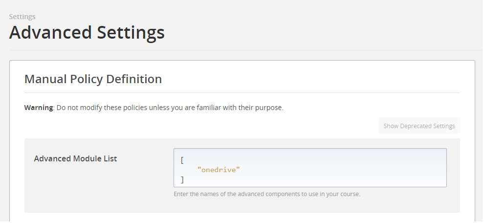
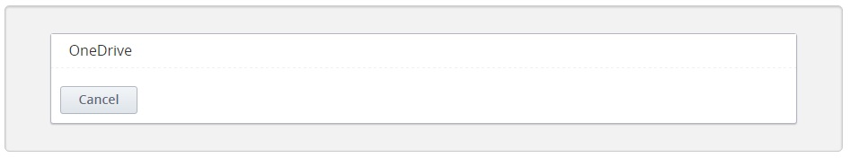
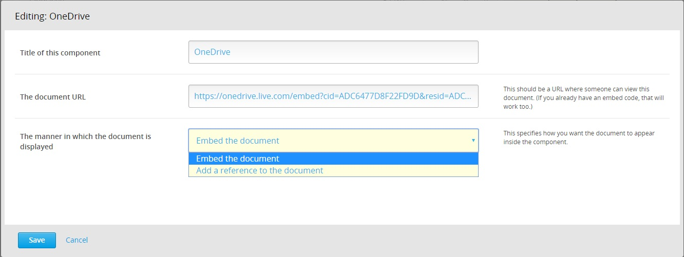
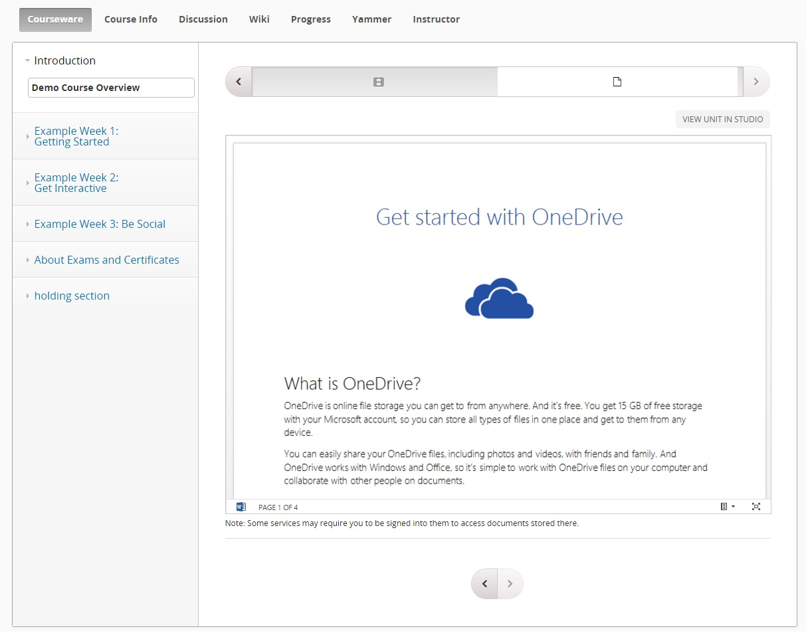

OneDrive XBlock
===================

The “OneDrive XBlock” allows course content authors to add documents stored in Microsoft OneDrive Online or OneDrive for Business to the course. The files can be added either as embedded content or as links to the files in their original location.

Students can view these files in their Open edX or edX.org courses.

Installation
------------

To install the OneDrive XBlock within your edX Python environment, run the following command:

```bash
$ pip install /path/to/xblock-onedrive/
```

Ensure that you have added the following to /edx/app/edxapp/edx-platform/cms/envs/common.py
- ALLOW_ALL_ADVANCED_COMPONENTS: True

Also ensure that you have restarted edX services after these steps.

Enabling in Studio
------------------

To enable the OneDrive XBlock within studio:

1. Navigate to `Settings -> Advanced Settings` from the top nav bar.
2. Add `"onedrive"` to the Advanced Module List, as shown in the screen shot below.



Usage
-----
Once enabled in Studio, it's easy to use the OneDrive XBlock.

Start by navigating to the unit in studio where you want to insert your file. From here choose the `Advanced` component.


This will bring up a list of the XBlocks that have been enabled in Studio. If you followed the previous step to enable the OneDrive XBlock in Studio you will see an option titled `OneDrive`. Click on it to insert the OneDrive XBlock into your unit.



After you've inserted the OneDrive XBlock, a default document will be inserted into your unit as shown in the screen shot below.


To change the file added to the course using the OneDrive XBlock, click on the `Edit` button on the upper-right corner of the XBlock. This will bring up the edit dialog where you can change the display name of the component as well as the  document that is being inserted and how you want it to be embedded.



In this dialog, you can

- Update the XBlock title.
- Enter the URL or embed code for the file from its original location (in OneDrive) 
    - Note that the file must be accessible to the intended audience. 
    - Also, note that you do not need to obtain an embed code for the file yourself. The OneDrive XBlock can build it automatically. 
- Also note that this XBlock can handle both, OneDrive Online as well as OneDrive for Business documents.

- Select the way you want the file to be displayed inside the xblock:
    - Embedded inside an iframe OR
    - As a link to the file in its original location

After you click save, your OneDrive XBlock will have been updated with the new values.


At this point simply click on the `Publish` button and the file will be available for students to view it from the LMS.



Troubleshooting
---------------

In case the XBlock fails to appear in the Advanced menu or other errors, you may check the following:
- Run `sudo -u edxapp /edx/bin/pip.edxapp list`, to verify that "xblock-onedrive" is installed
- Verify that "XBLOCK_SELECT_FUNCTION = prefer_xmodules" is present in the following config files:
  - /edx/app/edxapp/edx-platform/lms/envs/common.py
  - /edx/app/edxapp/edx-platform/cms/envs/common.py
- Ensure that you have restarted edX services after installing the XBlock
